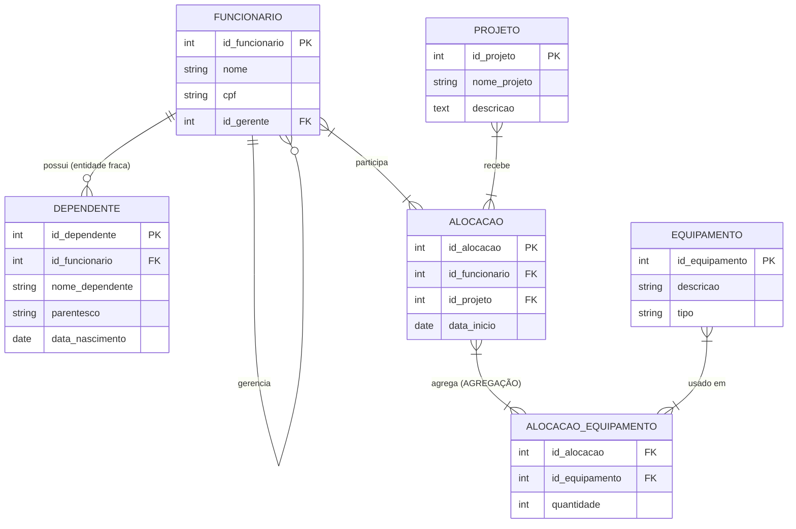

# Sistema de Gestão de Projetos e Equipes

Atividade prática de Banco de Dados — implementação em PostgreSQL com os conceitos de **Entidade Fraca**, **Autorelacionamento** e **Agregação**

---

## Diagrama



---

## Como o Autorelacionamento foi aplicado

A tabela `FUNCIONARIO` possui a coluna `id_gerente`, que é uma **chave estrangeira apontando para a própria tabela**. Isso permite modelar hierarquias de qualquer profundidade dentro de uma única tabela.

- O funcionário no topo da hierarquia tem `id_gerente = NULL`
- Todos os outros funcionários apontam para o `id_funcionario` do seu superior direto

**Consulta demonstrativa (dica do professor):**
```sql
SELECT
    f.nome   AS funcionario,
    g.nome   AS supervisor
FROM funcionario f
LEFT JOIN funcionario g ON f.id_gerente = g.id_funcionario;
```

---

## Como a Agregação resolveu o uso de equipamentos em projetos

O problema central: um equipamento não pertence a um funcionário em geral, nem a um projeto em geral. Ele pertence a **"um funcionário trabalhando em um projeto específico"**.

Para resolver isso, o relacionamento `ALOCACAO` (que conecta `FUNCIONARIO` e `PROJETO`) foi **elevado a entidade** — isso é a agregação. A tabela `ALOCACAO_EQUIPAMENTO` então referencia a `ALOCACAO`, ligando o equipamento ao par (funcionário + projeto), não a cada um isoladamente.

**Estrutura resultante:**
```
FUNCIONARIO ──┐
              ├──> ALOCACAO ──> ALOCACAO_EQUIPAMENTO <── EQUIPAMENTO
PROJETO    ──┘
```

---

## Entidade Fraca — Dependente

`DEPENDENTE` é uma entidade fraca porque **não possui identidade própria**: um dependente só existe enquanto o funcionário ao qual pertence existir.

- A **chave primária é composta**: `(id_dependente, id_funcionario)`
- O `ON DELETE CASCADE` garante que ao deletar um funcionário, todos os seus dependentes são automaticamente removidos

---
